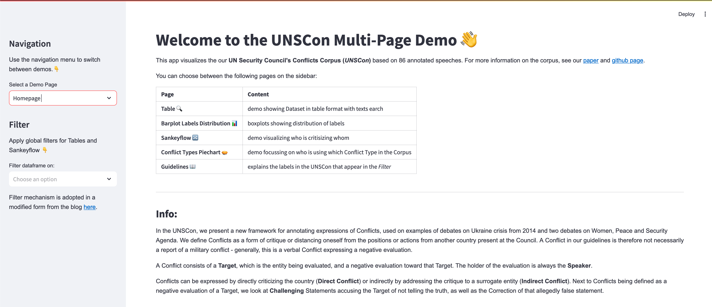

# UNSC Conflicts Corpus Demo 

*NOTE: This repository is a work in progress.*

This This app visualizes the our **UN Security Council's Conflicts Corpus (UNSCon)** based on 86 annotated speeches.
For more information on the corpus, see our [paper](https://aclanthology.org/2024.lrec-main.716/) and [github repo](https://github.com/linatal/UNSCon).
We build the app using [Streamlit](https://streamlit.io/).



To run the demo download the requirements typing in your terminal:  
```pip -r requirements.txt```
Then run the app: ```streamlit run ./app.py``` 